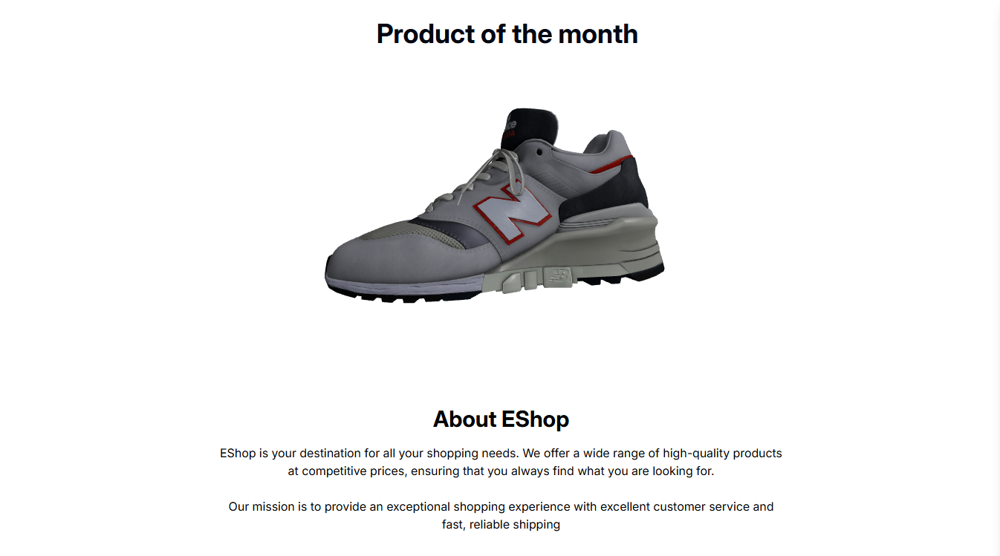

# E-Commerce Platform

## 🚀 Overview
This project was developed during my internship to Improve accuracy towards MERN stack and Redux core concepts. It is designed to enable users to browse products, add items to their cart, and securely complete purchases.

## ⚒️ Tech Stack
- Frontend [React]
- Backend [Node.js,Express.js]
- Database [MongoDB]
- Icons [Lucide-react]
- Other techs [Tailwind CSS,Redux,Redux-saga]

## ✨ Features
- User Authentication and User Management
- Product Browsing and Searching Functionality
- Shopping Cart and Checkout System

## 📦 Installation & Setup

1. Clone the repository:
   ```sh
   git clone https://github.com/Darshil0109/E-commerce.git
   cd E-commerce
   ```

2. Install dependencies:
   
   Root Directory : ` E-commerce/ `
   ```sh
   cd Frontend
   npm install  # or yarn install
   ```
   ```sh
   cd Backend
   npm install  # or yarn install
   ```
3. Configure .env File:
- create .env file in both of your Frontend & Backend folders.
### backend .env
   ```sh
   MONGO_URI=<Your MongoDB URL>
   JWT_SECRET=<YOUR_JWT_SECRET>
   PORT=<YOUR_PORT>
   ALLOWED_ORIGIN=<URL_of_your_Frontend_app>
   ```
### frontend .env
   ```sh
   VITE_API_URL="Your Backend API url" 
   ```

4. Start the development server:
   ```sh
   npm run dev  # or yarn dev
   ```

## 🚀 Usage
Users can register, browse products, add them to their cart, and complete purchases. 

## 📩 Contact
For any inquiries, reach out at [darshil01092004@gmail.com].


## Screenshots





